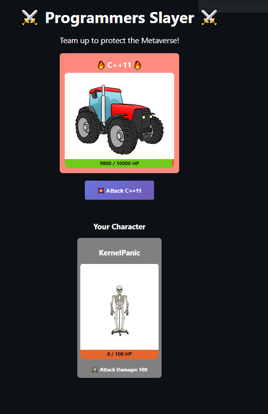

# Create your own mini turn-based NFT browser game

## Introduction

This project was carried out by following the tutorial proposed by buildspace.

Website : https://app.buildspace.so/

Tutorial : " Create your own mini turn-based NFT browser game"

Each branch represents a step of the tutorial

Steps of the tutorial

1 -- **We're going to write a smart contract**. That contract has all the logic around our actual game.

2 -- **Our smart contract will be deployed to the blockchain**. 

3 -- **We're going to build a client website** that will let people easily connect their Ethereum wallet and play our game.

## Results

Web app made with replit.com : https://replit.com/@rya-sge/nft-game-starter-project

Link wep app : https://nft-game-starter-project.rya-sge.repl.co

Last version of the collection available on OpenSea : https://testnets.opensea.io/collection/heroes-jadcuyxonr

Last contract address : 0xaF8c532A42f0f61d80583F5a912e723caa2532E7



## Basic Sample Hardhat Project

Commands

```shell
npx hardhat accounts
npx hardhat compile
npx hardhat clean
npx hardhat test
npx hardhat node
node scripts/sample-script.js
npx hardhat help
```

